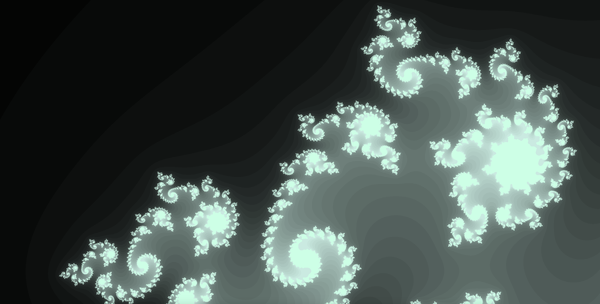
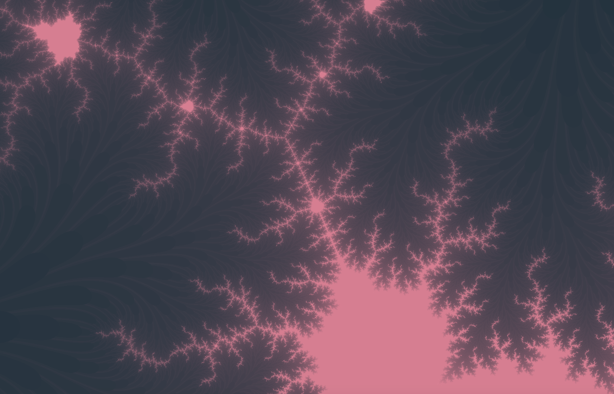

# 42_fractal

This program displays different fractals and lets you customize them using your mouse and keyboard. 
This was done as part of the 42 Silicon Valley curiculum.

## Input

Arrow keys : move.

Space : freeze fractal.

Mouse wheel : zoom in/out.

q - e : change fractal.

a - d : decrease/increase number of iterations.

w : change outskirts display mode.

s : reverse colors.

r - t : decrease/increase inner red

f - g : decrease/increase inner green

v - b : decrease/increase inner blue

y - u : decrease/increase outer red

h - j : decrease/increase outer green

n - m : decrease/increase outer blue

## Screenshots

